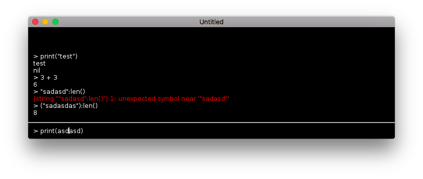

# love-console



## Features
- Activate and deactivate the console with the `~` key.
- Use the `left` and `right` arrows to navigate the cursor.
  - `alt-left` and `alt-right` navigate by word.
  - `ctrl-left` and `ctrl-right` navigate to the end of the line.
- Evaluate both expressions and statements.
- Use the up and down arrow keys to access history.
- Use `_` to access the last returned value, and `last` to access all of the last returned values as a table.
- Use `ctrl+` and `ctrl-` to change font size.
- Type `clear` to clear the console.
  - Add custom commands to `console.COMMANDS`.
- Use `console.ENV` to expose objects to the REPL.

## Integrating the Console

```lua
local console = require "console"
love.keyboard.setKeyRepeat(true) -- Not required.

function love.keypressed(key, scancode, isrepeat)
  console.keypressed(key, scancode, isrepeat)
end

function love.textinput(text)
  console.textinput(text)
end

function love.draw()
  console.draw()
end

-- This function is run when the user types "save" into the console.
console.COMMANDS.save = function()
  -- Example: save game state
end

-- This table is available as "player" in the console scope.
console.ENV.player = {x = 100, y = 5}
```
